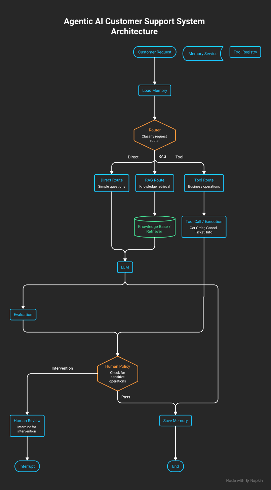

# Agentic AI Customer Support

An agentic AI customer support system built with **LangGraph** and **LLMs** to handle customer requests, retrieve relevant knowledge, use business tools, maintain conversation memory, evaluate responses, and route sensitive operations to human review.

## Overview

The goal of this project is to build a realistic customer-support AI agent rather than a simple chatbot.

The agent can:

* Understand customer requests
* Classify the request and select an appropriate route
* Answer simple questions directly with an LLM
* Retrieve information from the Knowledge Base using RAG
* Use business tools such as order lookup and order cancellation
* Maintain conversation memory
* Evaluate RAG-generated responses
* Detect sensitive operations
* Pause the workflow and request human review
* Handle errors and retry transient failures

---

## Architecture

The current workflow is based on LangGraph:



### Routes

The router currently selects one of three main routes:

* `direct` — simple requests answered directly by the LLM
* `rag` — requests requiring knowledge retrieval
* `tool` — requests requiring a business operation

---

## Main Components

### Agent

The agent coordinates the overall workflow using LangGraph.

Main responsibilities:

* Routing
* LLM interaction
* Tool execution
* RAG
* Evaluation
* Human review
* Memory management
* Error handling

### Knowledge Base

The Knowledge Base provides information required for customer-support questions.

The RAG pipeline currently includes:

```text
Query
  ↓
Retriever
  ↓
Retrieved Documents
  ↓
LLM
  ↓
Generated Answer
  ↓
Evaluation
```

Retrieval results include information such as:

* Retrieved documents
* Retrieval scores
* Top-1 score
* Mean retrieval score

The system also evaluates the generated answer using faithfulness/groundedness information.

---

## Tools

Business operations are exposed to the agent as tools.

Current examples include:

* `get_order`
* `cancel_order`
* `create_ticket`
* `customer_info`
* `search_knowledge_base`

The architecture separates the business function from tool execution.

```text
Tool
 ↓
ToolExecutor
 ↓
ToolResult
 ↓
ToolNode
 ↓
Agent State
```

### ToolExecutor

`ToolExecutor` is responsible for runtime execution and error handling.

It handles:

* Tool lookup
* Tool execution
* Retry logic
* Error classification
* Returning a standardized `ToolResult`

Example result:

```python
ToolResult(
    tool_name="get_order",
    success=True,
    result={
        "order_id": 1234,
        "status": "processing"
    }
)
```

---

## Memory

The agent uses a `MemoryService` for conversation memory.

Memory is loaded at the beginning of the workflow:

```text
START
 ↓
Load Memory
 ↓
Router
```

and saved after the workflow is completed:

```text
LLM / Tool Workflow
 ↓
Save Memory
 ↓
END
```

This allows the agent to maintain context across conversations and sessions.

---

## Human Review

Sensitive operations should not be executed automatically.

For example:

```text
Customer:
"I want my order with id 1234 to be canceled."

        ↓

Router
        ↓
Tool Route
        ↓
cancel_order
        ↓
Human Policy
        ↓
Sensitive Operation
        ↓
Human Review
        ↓
LangGraph interrupt
```

The system currently uses **LangGraph `interrupt()`** to pause the workflow.

At this stage, the workflow stops at the human-review interrupt. The external approval/resume mechanism will be implemented later when an API or UI is added.

---

## Error Handling

The project has a dedicated error-handling layer.

Errors are classified into categories such as:

* `TRANSIENT`
* `PERMANENT`
* `UNKNOWN`

The system uses an `ErrorPolicy` to decide what should happen after an error.

Possible recovery actions include:

* Retry
* Human review
* Fail

Transient errors can be retried using the project's `RetryPolicy`.

The retry mechanism includes:

* Maximum retries
* Initial delay
* Maximum delay
* Backoff factor
* Jitter

The node wrapper applies this policy around agent nodes.

LangGraph control-flow exceptions such as `interrupt()` are preserved so that LangGraph can handle them correctly.

---

## Testing

Testing is an important part of the project.

The test suite covers components such as:

* Agent workflow
* Router
* Error handling
* Error policy
* Retry policy
* Human review
* Tool execution

Workflow integration tests use the **real selected LLM** where appropriate to verify the actual model and integration configuration.

Mocks can still be used for heavy or isolated dependencies when necessary.

---

## Technology Stack

* **Python**
* **LangGraph**
* **LangChain**
* **LLM / ChatOpenAI-compatible API**
* **RAG**
* **Sentence Transformers**
* **FAISS**
* **PostgreSQL**
* **Redis**
* **Docker**
* **Git / GitHub**
* **unittest**

---

## Project Structure

The main project areas are organized around the agent, knowledge base, evaluation, tools, memory, and tests.

```text
Agentic-AI-Customer-Support/
│
├── agent/
│   ├── errors/
│   ├── human_loop/
│   ├── memory/
│   ├── tools/
│   ├── nodes.py
│   ├── graph.py
│   └── state.py
│
├── knowledge_base/
│   ├── loaders/
│   ├── processing/
│   ├── embeddings/
│   ├── retriever/
│   └── vector_stores/
│
├── evaluation/
│
├── tests/
│   └── agent_tests/
│
├── docs/
│
├── scripts/
│
├── data/
│
├── Dockerfile
├── docker-compose.yml
└── README.md
```

---

## Running the Project

Create and activate the virtual environment:

```powershell
python -m venv venv
.\venv\Scripts\Activate.ps1
```

Install dependencies:

```powershell
pip install -r requirements.txt
```

Configure the required environment variables in `.env`.

Run the agent workflow tests:

```powershell
python -m tests.agent_tests.agent_workflow_test
```

---

## Current Status

### Implemented

* [x] LangGraph agent workflow
* [x] Direct LLM route
* [x] RAG route
* [x] Tool route
* [x] Tool registry
* [x] Tool executor
* [x] Tool error handling
* [x] Retry policy
* [x] Conversation memory
* [x] RAG evaluation
* [x] Human review policy
* [x] Sensitive tool operation detection
* [x] LangGraph interrupt for human review
* [x] Agent workflow tests

### Planned

* [ ] Human approval/resume flow
* [ ] API layer
* [ ] Customer-support UI
* [ ] Production database integration
* [ ] More business tools
* [ ] More comprehensive evaluation and monitoring

---

## Project Goal

The long-term goal is to build a production-oriented **Agentic AI Customer Support Platform** where an AI agent can understand customer requests, retrieve reliable information, perform controlled business operations, remember conversation context, evaluate its own answers, and involve human operators when necessary.
